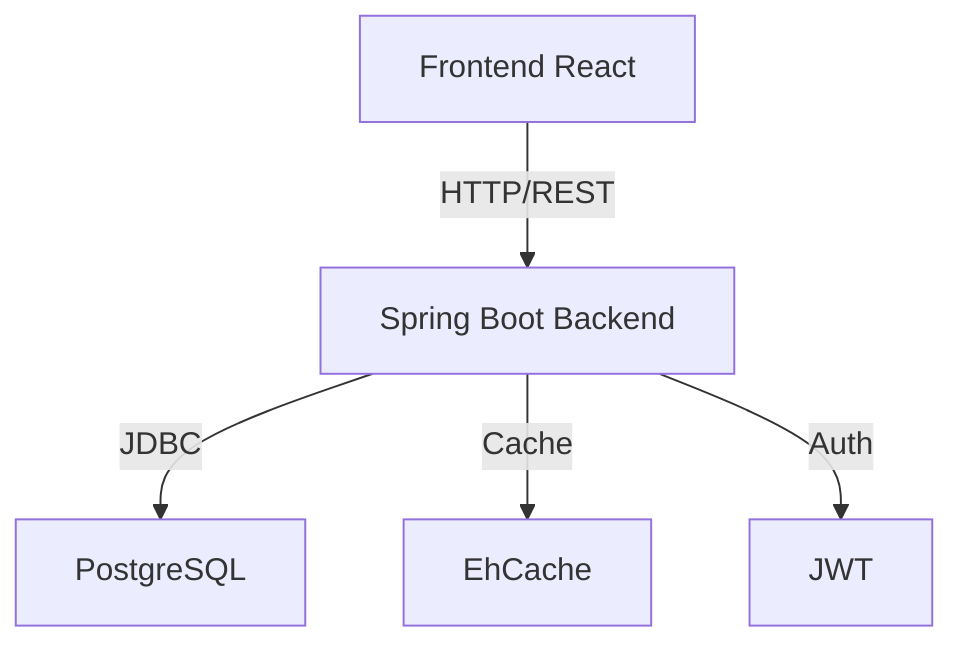

# Análisis de Buenas Prácticas - QuimbayaEVAL

**Fecha**: Marzo 6, 2026  
**Proyecto**: QuimbayaEVAL Backend + Frontend  
**Stack**: Java 17 + Spring Boot 3.2 + PostgreSQL + React 18 + TypeScript

---

## 📊 Resumen Ejecutivo

### Puntuación General: 7.5/10

El proyecto QuimbayaEVAL muestra una arquitectura sólida con buenas prácticas en su mayoría, pero tiene áreas importantes de mejora en seguridad, validación y manejo de errores.

### Fortalezas Principales ✅
- Arquitectura en capas bien definida (Controller → Service → DAO)
- Uso de JDBC puro con PreparedStatements (prevención SQL injection)
- Sistema de caché implementado (EhCache)
- Rate limiting configurado
- Tests unitarios e integración presentes
- Documentación completa (Swagger/OpenAPI)
- Separación clara de responsabilidades

### Áreas Críticas de Mejora ⚠️
- Validación de entrada insuficiente
- Manejo de excepciones genérico
- Seguridad: JWT secret hardcodeado en código
- Falta de logging estructurado
- Ausencia de DTOs en algunos endpoints
- CORS configurado con `origins = "*"` en controladores

---

## 1. Arquitectura y Diseño

### ✅ Buenas Prácticas Implementadas

**1.1 Separación de Capas**
```
Controller (REST API) → Service (Lógica de negocio) → DAO (Acceso a datos)
```

- Cada capa tiene responsabilidades claras
- No hay lógica de negocio en controladores
- DAOs encapsulan acceso a base de datos

**1.2 Patrón DAO Implementado Correctamente**
```java
// EvaluacionDao.java - Ejemplo de buena práctica
public Optional<Evaluacion> findById(Integer id) {
    List<Evaluacion> evals = jdbcTemplate.query(SQL_SELECT_BY_ID, rowMapper, id);
    return evals.isEmpty() ? Optional.empty() : Optional.of(evals.get(0));
}
```
- Uso de `Optional<>` para valores que pueden no existir
- RowMapper reutilizable
- Queries SQL como constantes

**1.3 DTOs para Respuestas API**
```java
// ApiResponse.java - Respuesta estandarizada
public class ApiResponse<T> {
    private boolean success;
    private String message;
    private T data;
}
```

### ⚠️ Áreas de Mejora

**1.1 Falta de DTOs para Requests**
```java
// ❌ Problema actual en AuthController
@PostMapping("/login")
public ResponseEntity<ApiResponse<LoginResponse>> login(@RequestBody LoginRequest loginRequest)
```


**Recomendación**: Crear DTOs específicos para requests complejos:
```java
// ✅ Mejor práctica
public class CrearEvaluacionRequest {
    @NotBlank(message = "El nombre es obligatorio")
    private String nombre;
    
    @NotNull(message = "El curso es obligatorio")
    private Integer cursoId;
    
    @Future(message = "La fecha límite debe ser futura")
    private LocalDateTime deadline;
    
    // getters, setters
}
```

**1.2 Ausencia de Mapper entre Entidades y DTOs**

**Recomendación**: Implementar mappers (manual o con MapStruct):
```java
public class EvaluacionMapper {
    public static EvaluacionDTO toDTO(Evaluacion entity) {
        // Mapeo manual o con MapStruct
    }
    
    public static Evaluacion toEntity(EvaluacionDTO dto) {
        // Mapeo inverso
    }
}
```

---

## 2. Seguridad

### ✅ Buenas Prácticas Implementadas

**2.1 JWT para Autenticación**
- Tokens stateless
- Expiración configurada (24 horas)
- Claims personalizados (userId, role)


**2.2 BCrypt para Contraseñas**
```java
@Bean
public PasswordEncoder passwordEncoder() {
    return new BCryptPasswordEncoder();
}
```

**2.3 PreparedStatements (Prevención SQL Injection)**
```java
// ✅ Uso correcto de PreparedStatements
private static final String SQL_SELECT_BY_ID = 
    "SELECT * FROM evaluaciones WHERE id = ?";
jdbcTemplate.query(SQL_SELECT_BY_ID, rowMapper, id);
```

**2.4 Validación de Nombres de Columna**
```java
// JdbcQueryBuilder.java
private static boolean isValidColumnName(String columnName) {
    return columnName != null && columnName.matches("^[a-zA-Z0-9_\\.]+$");
}
```

### 🔴 Problemas Críticos de Seguridad

**2.1 JWT Secret Hardcodeado**
```yaml
# ❌ application.yml - CRÍTICO
jwt:
  secret: tu-clave-secreta-muy-larga-y-segura-cambiar-en-produccion-debe-tener-minimo-256-bits
```

**Impacto**: Cualquiera con acceso al código puede generar tokens válidos.

**Solución**:
```yaml
# ✅ Usar variable de entorno
jwt:
  secret: ${JWT_SECRET}
```


```bash
# Generar secret seguro
openssl rand -base64 64
```

**2.2 CORS Abierto en Controladores**
```java
// ❌ Problema en todos los controladores
@CrossOrigin(origins = "*")
public class AuthController {
```

**Impacto**: Permite requests desde cualquier origen (XSS, CSRF).

**Solución**: Eliminar `@CrossOrigin` de controladores, usar solo configuración centralizada:
```java
// ✅ SecurityConfig.java ya tiene configuración correcta
configuration.setAllowedOrigins(Arrays.asList(
    "http://localhost:5173",
    "http://localhost:3000"
));
```

**2.3 Falta de Autorización por Rol**
```java
// ❌ Cualquier usuario autenticado puede acceder
@GetMapping("/api/evaluaciones")
public ResponseEntity<ApiResponse<List<Evaluacion>>> obtenerTodas()
```

**Solución**: Implementar autorización basada en roles:
```java
// ✅ Agregar en SecurityConfig
.requestMatchers("/api/evaluaciones/**").hasAnyRole("MAESTRO", "COORDINADOR")
.requestMatchers("/api/usuarios/**").hasRole("COORDINADOR")
```


**2.4 Ausencia de Rate Limiting Activo**

Aunque existe `RateLimitingInterceptor.java`, no está registrado en `WebMvcConfig`.

**Solución**:
```java
// WebMvcConfig.java
@Override
public void addInterceptors(InterceptorRegistry registry) {
    registry.addInterceptor(rateLimitingInterceptor)
            .addPathPatterns("/api/**");
}
```

---

## 3. Validación de Datos

### ⚠️ Validación Insuficiente

**3.1 Falta de Anotaciones de Validación**
```java
// ❌ Problema actual
@PostMapping
public ResponseEntity<ApiResponse<Evaluacion>> crear(@RequestBody Evaluacion evaluacion)
```

**Solución**:
```java
// ✅ Usar Bean Validation
@PostMapping
public ResponseEntity<ApiResponse<Evaluacion>> crear(
    @Valid @RequestBody CrearEvaluacionRequest request) {
    // Spring valida automáticamente
}

// DTO con validaciones
public class CrearEvaluacionRequest {
    @NotBlank(message = "Nombre requerido")
    @Size(min = 3, max = 255)
    private String nombre;
    
    @NotNull
    @Positive
    private Integer cursoId;
}
```


**3.2 Validación Manual en Servicios**

Actualmente no hay validación de reglas de negocio:
```java
// ❌ No valida si deadline es futura
public Evaluacion crear(Evaluacion evaluacion) {
    return evaluacionDao.save(evaluacion);
}
```

**Solución**:
```java
// ✅ Validar reglas de negocio
public Evaluacion crear(Evaluacion evaluacion) {
    if (evaluacion.getDeadline() != null && 
        evaluacion.getDeadline().isBefore(LocalDateTime.now())) {
        throw new IllegalArgumentException("La fecha límite debe ser futura");
    }
    
    if (evaluacion.getDuracionMinutos() <= 0) {
        throw new IllegalArgumentException("Duración debe ser positiva");
    }
    
    return evaluacionDao.save(evaluacion);
}
```

---

## 4. Manejo de Errores

### ⚠️ Manejo Genérico

**4.1 GlobalExceptionHandler Básico**
```java
// ❌ Muy genérico, pierde información
@ExceptionHandler(Exception.class)
public ResponseEntity<ApiResponse<Object>> handleGlobalException(Exception ex) {
    return ResponseEntity
        .status(HttpStatus.INTERNAL_SERVER_ERROR)
        .body(ApiResponse.error("Error interno: " + ex.getMessage()));
}
```


**Solución**: Crear excepciones personalizadas:
```java
// ✅ Excepciones específicas
public class ResourceNotFoundException extends RuntimeException {
    public ResourceNotFoundException(String resource, Integer id) {
        super(String.format("%s con ID %d no encontrado", resource, id));
    }
}

public class ValidationException extends RuntimeException {
    private Map<String, String> errors;
    
    public ValidationException(Map<String, String> errors) {
        super("Errores de validación");
        this.errors = errors;
    }
}

// Handler mejorado
@ExceptionHandler(ResourceNotFoundException.class)
public ResponseEntity<ApiResponse<Object>> handleNotFound(ResourceNotFoundException ex) {
    return ResponseEntity
        .status(HttpStatus.NOT_FOUND)
        .body(ApiResponse.error(ex.getMessage()));
}

@ExceptionHandler(MethodArgumentNotValidException.class)
public ResponseEntity<ApiResponse<Map<String, String>>> handleValidation(
    MethodArgumentNotValidException ex) {
    Map<String, String> errors = new HashMap<>();
    ex.getBindingResult().getFieldErrors().forEach(error -> 
        errors.put(error.getField(), error.getDefaultMessage())
    );
    return ResponseEntity
        .status(HttpStatus.BAD_REQUEST)
        .body(ApiResponse.error("Errores de validación", errors));
}
```


**4.2 Try-Catch en Controladores**
```java
// ❌ Problema: Manejo manual en cada endpoint
@GetMapping("/{id}")
public ResponseEntity<ApiResponse<Evaluacion>> obtenerPorId(@PathVariable Integer id) {
    try {
        Optional<Evaluacion> evaluacion = evaluacionService.obtenerPorId(id);
        if (evaluacion.isPresent()) {
            return ResponseEntity.ok(ApiResponse.success(evaluacion.get()));
        }
        return ResponseEntity.status(HttpStatus.NOT_FOUND).body(
            ApiResponse.error("Evaluación no encontrada")
        );
    } catch (Exception e) {
        return ResponseEntity.status(HttpStatus.INTERNAL_SERVER_ERROR).body(
            ApiResponse.error("Error obteniendo evaluación: " + e.getMessage())
        );
    }
}
```

**Solución**: Dejar que GlobalExceptionHandler maneje:
```java
// ✅ Más limpio
@GetMapping("/{id}")
public ResponseEntity<ApiResponse<Evaluacion>> obtenerPorId(@PathVariable Integer id) {
    Evaluacion evaluacion = evaluacionService.obtenerPorId(id)
        .orElseThrow(() -> new ResourceNotFoundException("Evaluación", id));
    return ResponseEntity.ok(ApiResponse.success(evaluacion));
}
```

---

## 5. Base de Datos

### ✅ Buenas Prácticas

**5.1 Schema Bien Diseñado**
- Constraints CHECK para valores válidos
- Foreign keys con ON DELETE apropiados
- Índices en columnas frecuentemente consultadas
- Timestamps automáticos (created_at, updated_at)


```sql
-- ✅ Ejemplo de buenas prácticas
CREATE TABLE evaluaciones (
    id SERIAL PRIMARY KEY,
    tipo VARCHAR(50) NOT NULL CHECK (tipo IN ('Examen', 'Quiz', 'Taller', 'Proyecto', 'Tarea')),
    estado VARCHAR(50) NOT NULL DEFAULT 'Borrador' CHECK (estado IN ('Borrador', 'Programada', 'Activa', 'Cerrada')),
    curso_id INTEGER NOT NULL REFERENCES cursos(id) ON DELETE CASCADE,
    created_at TIMESTAMP DEFAULT CURRENT_TIMESTAMP
);

CREATE INDEX idx_evaluaciones_estado ON evaluaciones(estado);
```

**5.2 Uso de JSONB para Datos Flexibles**
```sql
-- ✅ Buena práctica para datos semi-estructurados
opciones_json JSONB,
respuesta_correcta_json JSONB
```

### ⚠️ Áreas de Mejora

**5.1 Falta de Migraciones Versionadas**

Actualmente solo hay `schema.sql`. Para producción:

**Recomendación**: Usar Flyway o Liquibase:
```
src/main/resources/db/migration/
├── V1__initial_schema.sql
├── V2__add_pqrs_table.sql
└── V3__add_indexes.sql
```

**5.2 Ausencia de Soft Delete**

Actualmente usa `DELETE` físico:
```java
public void deleteById(Integer id) {
    jdbcTemplate.update(SQL_DELETE, id);
}
```

**Recomendación**: Implementar soft delete:
```sql
ALTER TABLE evaluaciones ADD COLUMN deleted_at TIMESTAMP;
```


```java
public void softDelete(Integer id) {
    jdbcTemplate.update(
        "UPDATE evaluaciones SET deleted_at = CURRENT_TIMESTAMP WHERE id = ?", 
        id
    );
}
```

---

## 6. Performance y Escalabilidad

### ✅ Buenas Prácticas

**6.1 Caché Implementado**
```java
@Cacheable(value = "evaluacionesByCurso", key = "#cursoId")
public ResponseEntity<ApiResponse<List<Evaluacion>>> obtenerPorCurso(@PathVariable Integer cursoId)

@CacheEvict(value = {"evaluacionesByCurso", "evaluacionesByEstado"}, allEntries = true)
public ResponseEntity<ApiResponse<Evaluacion>> crear(@RequestBody Evaluacion evaluacion)
```

**6.2 Paginación Implementada**
```java
@GetMapping
public ResponseEntity<ApiResponse<List<Evaluacion>>> obtenerTodas(
    @RequestParam(required = false) Integer page,
    @RequestParam(required = false) Integer size,
    @RequestParam(required = false) String sort)
```

**6.3 Query Builder Dinámico**
```java
// JdbcQueryBuilder permite filtros complejos sin N+1 queries
public static QueryData build(String base,
                              List<FilterCriteria> filters,
                              String sortBy,
                              String direction,
                              Integer page,
                              Integer size)
```

### ⚠️ Áreas de Mejora

**6.1 N+1 Query Problem Potencial**


Si se obtienen evaluaciones con sus preguntas:
```java
// ❌ Potencial N+1
List<Evaluacion> evaluaciones = evaluacionDao.findAll();
for (Evaluacion eval : evaluaciones) {
    List<Pregunta> preguntas = preguntaDao.findByEvaluacion(eval.getId()); // N queries
}
```

**Solución**: Usar JOINs o batch fetching:
```java
// ✅ Una sola query con JOIN
SELECT e.*, p.* 
FROM evaluaciones e 
LEFT JOIN preguntas p ON e.id = p.evaluacion_id
WHERE e.curso_id = ?
```

**6.2 Falta de Connection Pooling Explícito**

Aunque Spring Boot configura HikariCP por defecto, no está explícito en `application.yml`.

**Recomendación**:
```yaml
spring:
  datasource:
    hikari:
      maximum-pool-size: 10
      minimum-idle: 5
      connection-timeout: 30000
      idle-timeout: 600000
      max-lifetime: 1800000
```

**6.3 Ausencia de Paginación en Respuesta**

Actualmente retorna solo la lista:
```java
// ❌ No incluye metadata de paginación
return ResponseEntity.ok(ApiResponse.success(cursos));
```

**Solución**:
```java
// ✅ Incluir metadata
public class PagedResponse<T> {
    private List<T> content;
    private int page;
    private int size;
    private long totalElements;
    private int totalPages;
}
```


---

## 7. Testing

### ✅ Buenas Prácticas

**7.1 Cobertura de Tests**
- Tests unitarios de servicios
- Tests de integración de controladores
- Tests de DAO con paginación
- Tests de filtros avanzados

**7.2 Estructura Organizada**
```
src/test/java/com/quimbayaeval/
├── controller/  (Integration tests)
├── service/     (Unit tests)
└── dao/         (DAO tests)
```

### ⚠️ Áreas de Mejora

**7.1 Falta de Tests de Seguridad**

No hay tests que verifiquen:
- Autorización por rol
- Validación de JWT
- Rate limiting

**Recomendación**:
```java
@Test
@WithMockUser(roles = "ESTUDIANTE")
public void estudianteNoPuedeCrearEvaluacion() {
    mockMvc.perform(post("/api/evaluaciones")
        .contentType(MediaType.APPLICATION_JSON)
        .content(evaluacionJson))
        .andExpect(status().isForbidden());
}
```

**7.2 Ausencia de Tests de Performance**

**Recomendación**: Agregar tests de carga con JMeter o Gatling.

---

## 8. Logging y Monitoreo

### ⚠️ Logging Insuficiente

**8.1 Solo Logging de Configuración**
```yaml
logging:
  level:
    root: INFO
    com.quimbayaeval: DEBUG
```


No hay logs en código:
```java
// ❌ Sin logging
public Evaluacion crear(Evaluacion evaluacion) {
    return evaluacionDao.save(evaluacion);
}
```

**Solución**:
```java
// ✅ Con logging estructurado
@Slf4j
@Service
public class EvaluacionService {
    
    public Evaluacion crear(Evaluacion evaluacion) {
        log.info("Creando evaluación: nombre={}, cursoId={}", 
                 evaluacion.getNombre(), evaluacion.getCursoId());
        try {
            Evaluacion nueva = evaluacionDao.save(evaluacion);
            log.info("Evaluación creada exitosamente: id={}", nueva.getId());
            return nueva;
        } catch (Exception e) {
            log.error("Error creando evaluación: {}", e.getMessage(), e);
            throw e;
        }
    }
}
```

**8.2 Falta de Métricas**

**Recomendación**: Integrar Spring Boot Actuator + Micrometer:
```xml
<dependency>
    <groupId>org.springframework.boot</groupId>
    <artifactId>spring-boot-starter-actuator</artifactId>
</dependency>
<dependency>
    <groupId>io.micrometer</groupId>
    <artifactId>micrometer-registry-prometheus</artifactId>
</dependency>
```

```yaml
management:
  endpoints:
    web:
      exposure:
        include: health,metrics,prometheus
  metrics:
    export:
      prometheus:
        enabled: true
```

---

## 9. Código Limpio

### ✅ Buenas Prácticas

**9.1 Nombres Descriptivos**
```java
// ✅ Nombres claros
public List<Evaluacion> obtenerConFiltrosAvanzados(...)
public Optional<Evaluacion> findById(Integer id)
```


**9.2 Constantes para SQL**
```java
// ✅ SQL como constantes
private static final String SQL_SELECT_BY_ID = 
    "SELECT id, nombre, ... FROM evaluaciones WHERE id = ?";
```

**9.3 Javadoc en Métodos Públicos**
```java
/**
 * Obtiene evaluaciones con filtros avanzados (LIKE, ENTRE, etc.)
 */
public List<Evaluacion> obtenerConFiltrosAvanzados(...)
```

### ⚠️ Áreas de Mejora

**9.1 Métodos Largos en Controladores**
```java
// ❌ Método con demasiada lógica
@GetMapping
public ResponseEntity<ApiResponse<List<Evaluacion>>> obtenerTodas(
    @RequestParam(required = false) Integer page,
    @RequestParam(required = false) Integer size,
    @RequestParam(required = false) String sort,
    @RequestParam(required = false) String direction,
    @RequestParam(required = false) String estado,
    @RequestParam(required = false) String tipo,
    @RequestParam(required = false) Integer cursoId,
    @RequestParam(required = false) String nombre,
    @RequestParam(required = false) Boolean publicada) {
    // 30+ líneas de lógica
}
```

**Solución**: Extraer a métodos privados o usar un FilterBuilder:
```java
// ✅ Más limpio
@GetMapping
public ResponseEntity<ApiResponse<List<Evaluacion>>> obtenerTodas(
    EvaluacionFilterParams params) {
    List<Evaluacion> evaluaciones = evaluacionService.obtenerConFiltros(params);
    return ResponseEntity.ok(ApiResponse.success(evaluaciones));
}
```

**9.2 Magic Numbers**
```java
// ❌ Números mágicos
ps.setInt(8, evaluacion.getDuracionMinutos() != null ? evaluacion.getDuracionMinutos() : 60);
```


**Solución**:
```java
// ✅ Constantes
private static final int DEFAULT_DURACION_MINUTOS = 60;
private static final int DEFAULT_INTENTOS_PERMITIDOS = 1;

ps.setInt(8, evaluacion.getDuracionMinutos() != null ? 
          evaluacion.getDuracionMinutos() : DEFAULT_DURACION_MINUTOS);
```

---

## 10. Frontend (React + TypeScript)

### ✅ Buenas Prácticas

**10.1 TypeScript para Type Safety**
```typescript
interface Evaluacion {
    id: number;
    nombre: string;
    estado: EstadoEvaluacion;
}
```

**10.2 Hooks Personalizados**
```typescript
const { evaluaciones, evaluacionesAbiertas } = useEvaluaciones();
const { user, login, logout } = useAuth();
```

**10.3 Componentes Reutilizables (Shadcn/ui)**
- Button, Card, Dialog, Table, etc.
- Consistencia visual

**10.4 Lazy Loading de Páginas**
```typescript
const DashboardEstudiante = React.lazy(() => import('./pages/DashboardEstudiante'));
```

### ⚠️ Áreas de Mejora

**10.1 Mock Data en Producción**
```typescript
// ❌ Actualmente usa mock data
const [cursos] = useState(mockCursos);
```

**Solución**: Ya documentado en FRONTEND.md - reemplazar con fetch al backend.


**10.2 Falta de Manejo de Errores en Fetch**
```typescript
// ❌ Sin manejo de errores
const response = await fetch('/api/login', { ... });
const data = await response.json();
```

**Solución**:
```typescript
// ✅ Con manejo de errores
try {
    const response = await fetch('/api/login', { ... });
    if (!response.ok) {
        throw new Error(`HTTP ${response.status}: ${response.statusText}`);
    }
    const data = await response.json();
    // ...
} catch (error) {
    console.error('Error en login:', error);
    toast.error('Error al iniciar sesión');
}
```

**10.3 Token en localStorage (Riesgo XSS)**
```typescript
// ⚠️ Vulnerable a XSS
localStorage.setItem('token', data.token);
```

**Recomendación**: Usar httpOnly cookies (requiere cambio en backend):
```java
// Backend: Enviar token en cookie
Cookie cookie = new Cookie("token", token);
cookie.setHttpOnly(true);
cookie.setSecure(true);
cookie.setPath("/");
response.addCookie(cookie);
```

---

## 11. DevOps y Deployment

### ✅ Buenas Prácticas

**11.1 Docker Compose para Desarrollo**
```yaml
services:
  postgres:
    image: postgres:15-alpine
  backend:
    build: .
    depends_on:
      postgres:
        condition: service_healthy
```

**11.2 Health Checks**
```yaml
healthcheck:
  test: ["CMD-SHELL", "pg_isready -U postgres"]
  interval: 10s
```


**11.3 Variables de Entorno**
```yaml
environment:
  SPRING_DATASOURCE_URL: jdbc:postgresql://postgres:5432/quimbayaeval
  JWT_SECRET: ${JWT_SECRET}
```

### ⚠️ Áreas de Mejora

**11.1 Falta de CI/CD Pipeline**

**Recomendación**: Crear `.github/workflows/ci.yml`:
```yaml
name: CI

on: [push, pull_request]

jobs:
  test:
    runs-on: ubuntu-latest
    steps:
      - uses: actions/checkout@v3
      - name: Set up JDK 17
        uses: actions/setup-java@v3
        with:
          java-version: '17'
      - name: Run tests
        run: mvn test
      - name: Build
        run: mvn package -DskipTests
```

**11.2 Ausencia de Profiles de Spring**

Actualmente solo hay `application.yml`.

**Recomendación**:
```
application.yml           (común)
application-dev.yml       (desarrollo)
application-prod.yml      (producción)
application-test.yml      (tests)
```

```yaml
# application-prod.yml
spring:
  datasource:
    url: ${DATABASE_URL}
logging:
  level:
    root: WARN
    com.quimbayaeval: INFO
```

**11.3 Falta de Documentación de Deployment**

**Recomendación**: Crear `DEPLOYMENT.md` con:
- Requisitos de infraestructura
- Variables de entorno requeridas
- Pasos de deployment
- Rollback procedures


---

## 12. Documentación

### ✅ Buenas Prácticas

**12.1 Documentación Completa**
- README.md detallado
- BACKEND_README.md con quick start
- FRONTEND.md con arquitectura completa
- INTEGRATION_GUIDE.md para conectar frontend-backend
- Swagger/OpenAPI integrado

**12.2 Comentarios en Código**
```java
/**
 * Controlador para Evaluaciones con soporte para filtrado avanzado, caché y rate limiting
 */
@RestController
```

### ⚠️ Áreas de Mejora

**12.1 Falta de Diagramas de Arquitectura**

**Recomendación**: Agregar diagramas con Mermaid:
```markdown
## Arquitectura



**12.2 Ausencia de ADRs (Architecture Decision Records)**

**Recomendación**: Documentar decisiones importantes:
```
docs/adr/
├── 001-usar-jdbc-puro.md
├── 002-jwt-para-autenticacion.md
└── 003-react-typescript-frontend.md
```

---

## 13. Recomendaciones Prioritarias

### 🔴 Críticas (Implementar Inmediatamente)

1. **Mover JWT_SECRET a variable de entorno**
   - Impacto: Seguridad crítica
   - Esfuerzo: 5 minutos


2. **Eliminar @CrossOrigin(origins = "*") de controladores**
   - Impacto: Seguridad alta
   - Esfuerzo: 10 minutos

3. **Implementar autorización por rol**
   - Impacto: Seguridad alta
   - Esfuerzo: 2 horas

4. **Agregar validación con @Valid en endpoints**
   - Impacto: Seguridad y estabilidad
   - Esfuerzo: 4 horas

### 🟡 Importantes (Próximas 2 Semanas)

5. **Crear excepciones personalizadas**
   - Impacto: Mantenibilidad
   - Esfuerzo: 3 horas

6. **Implementar logging estructurado**
   - Impacto: Observabilidad
   - Esfuerzo: 4 horas

7. **Agregar DTOs para requests**
   - Impacto: Validación y documentación
   - Esfuerzo: 6 horas

8. **Implementar soft delete**
   - Impacto: Recuperación de datos
   - Esfuerzo: 4 horas

### 🟢 Deseables (Próximo Sprint)

9. **Agregar migraciones con Flyway**
   - Impacto: Control de versiones DB
   - Esfuerzo: 3 horas

10. **Implementar tests de seguridad**
    - Impacto: Confianza en seguridad
    - Esfuerzo: 6 horas

11. **Integrar Spring Boot Actuator + Prometheus**
    - Impacto: Monitoreo
    - Esfuerzo: 4 horas

12. **Crear CI/CD pipeline**
    - Impacto: Automatización
    - Esfuerzo: 8 horas

---

## 14. Checklist de Implementación

### Seguridad
- [ ] JWT secret en variable de entorno
- [ ] Eliminar @CrossOrigin de controladores
- [ ] Implementar @PreAuthorize en endpoints
- [ ] Activar rate limiting
- [ ] Agregar validación @Valid
- [ ] Implementar HTTPS en producción
- [ ] Configurar CORS restrictivo


### Validación
- [ ] Crear DTOs para requests
- [ ] Agregar anotaciones Bean Validation
- [ ] Validar reglas de negocio en servicios
- [ ] Manejar MethodArgumentNotValidException

### Manejo de Errores
- [ ] Crear excepciones personalizadas
- [ ] Mejorar GlobalExceptionHandler
- [ ] Eliminar try-catch de controladores
- [ ] Agregar logging de errores

### Base de Datos
- [ ] Implementar Flyway para migraciones
- [ ] Agregar soft delete
- [ ] Configurar connection pooling explícito
- [ ] Optimizar queries con JOINs

### Performance
- [ ] Agregar metadata de paginación
- [ ] Revisar N+1 queries
- [ ] Configurar cache TTL
- [ ] Implementar batch operations

### Testing
- [ ] Tests de autorización
- [ ] Tests de validación
- [ ] Tests de performance
- [ ] Aumentar cobertura a >80%

### Logging y Monitoreo
- [ ] Agregar @Slf4j a servicios
- [ ] Implementar logging estructurado
- [ ] Integrar Spring Boot Actuator
- [ ] Configurar Prometheus/Grafana

### DevOps
- [ ] Crear profiles de Spring
- [ ] Implementar CI/CD
- [ ] Documentar deployment
- [ ] Configurar health checks

### Documentación
- [ ] Agregar diagramas de arquitectura
- [ ] Crear ADRs
- [ ] Documentar APIs con ejemplos
- [ ] Actualizar README con cambios

---

## 15. Conclusión

QuimbayaEVAL es un proyecto bien estructurado con una base sólida, pero requiere mejoras en seguridad y validación antes de producción.


### Puntos Fuertes
- Arquitectura en capas clara
- Uso correcto de JDBC con PreparedStatements
- Caché y paginación implementados
- Tests presentes
- Documentación completa

### Puntos Críticos a Resolver
- JWT secret hardcodeado
- CORS abierto
- Falta de autorización por rol
- Validación insuficiente
- Manejo de errores genérico

### Tiempo Estimado para Mejoras Críticas
- Seguridad básica: 4-6 horas
- Validación completa: 8-10 horas
- Logging y monitoreo: 6-8 horas
- Total: ~20-24 horas de desarrollo

### Próximos Pasos Recomendados

1. **Semana 1**: Implementar mejoras críticas de seguridad
2. **Semana 2**: Agregar validación y excepciones personalizadas
3. **Semana 3**: Implementar logging y monitoreo
4. **Semana 4**: Tests de seguridad y CI/CD

---

## 16. Recursos Adicionales

### Documentación Oficial
- [Spring Security](https://spring.io/projects/spring-security)
- [Bean Validation](https://beanvalidation.org/)
- [Spring Boot Actuator](https://docs.spring.io/spring-boot/docs/current/reference/html/actuator.html)
- [Flyway](https://flywaydb.org/documentation/)

### Herramientas Recomendadas
- SonarQube para análisis de código
- OWASP Dependency Check para vulnerabilidades
- JaCoCo para cobertura de tests
- Postman/Insomnia para testing de API

---

**Documento generado**: Marzo 6, 2026  
**Revisado por**: Kiro AI Assistant  
**Próxima revisión**: Después de implementar mejoras críticas
